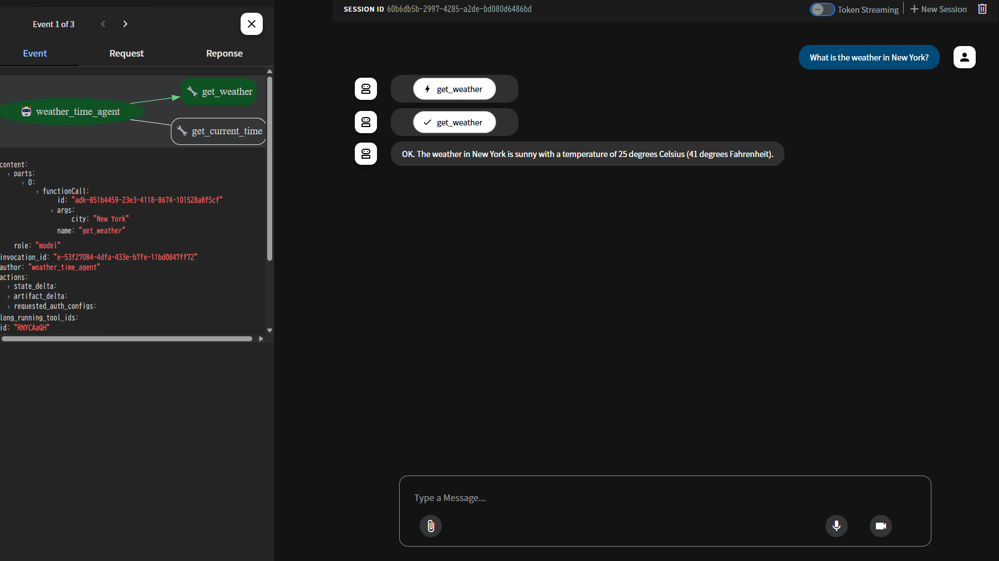

<div align="center">

# 🌟 ADK(Agent Development Kit) Sample Minimum

[](https://www.python.org/)
[](https://developers.google.com/adk)
[](LICENSE)


このプロジェクトは、Google ADKを使用して作られた天気と時間を教えてくれるAIエージェントだよ！✨

</div>

## 📂 プロジェクト構成

- [📱 エージェントの実装詳細](multi_tool_agent/README.md)
- [📚 ドキュメントとアセット](docs/README.md)

## 📋 機能

- 🌤️ 指定した都市の天気情報を取得
- 🕒 指定した都市の現在時刻を取得

## 🚀 セットアップ方法

### 1. 環境準備

Pythonの仮想環境を作成してアクティベートするよ：

```bash
# 仮想環境の作成
python -m venv .venv

# 仮想環境のアクティベート
# Windows PowerShell:
.venv\Scripts\Activate.ps1
# Windows CMD:
.venv\Scripts\activate.bat
# macOS/Linux:
source .venv/bin/activate
```

### 2. 必要なパッケージのインストール

```bash
pip install google-adk
```

### 3. 環境設定

1. Google AI Studioで[APIキーを取得](https://makersuite.google.com/app/apikey)してね！
2. `.env`ファイルの`GOOGLE_API_KEY`にAPIキーを設定：

```env
GOOGLE_GENAI_USE_VERTEXAI="False"
GOOGLE_API_KEY="あなたのAPIキーをここに入れてね"
```

## 💫 使い方

1. エージェントの起動：

```bash
adk web
```

2. ブラウザで表示されたURL（通常は http://localhost:8000）にアクセス
3. 左上のドロップダウンメニューから "multi_tool_agent" を選択
4. チャットボックスでエージェントと会話開始！

## 📱 使用例



## 📝 サンプルプロンプト

- "What is the weather in New York?"
- "What is the time in New York?"
- "What is the weather in Paris?"
- "What is the time in Paris?"

## 🎯 注意点

- 現在のバージョンでは、ニューヨークの情報のみ利用可能だよ！
- 音声対話には `gemini-2.0-flash-exp` モデルが必要だよ！

## 🌈 お問い合わせ

質問や提案があったら、気軽にIssueを作ってね！✨
